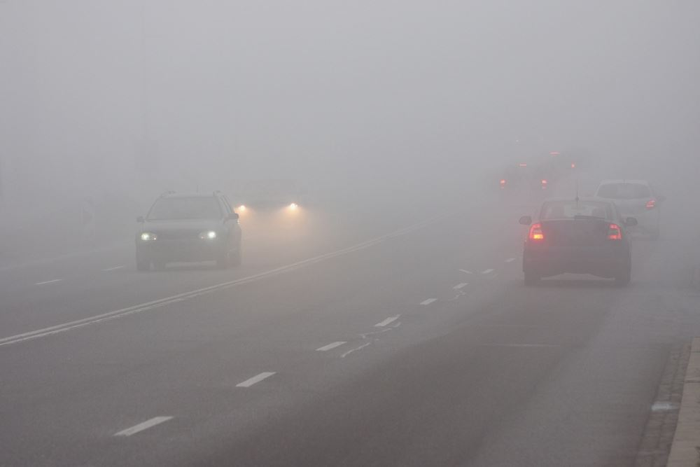

[Home](index.md) | [Classical](classical.md) | [Deep Learning](deep-learning.md) | [Datasets & Eval](datasets.md) | [Success/Failure](successes-failures.md) | [Challenges](challenges.md) | [Future](future.md) | [Refs](bibliography.md)

# Challenges

Traffic sign recognition faces two main groups of challenges.

## Technical Challenges
Systems must handle variation in scale, motion blur, low lighting, occlusion, and differences in sign appearance across regions.

## Deployment Challenges
The challenge is efficiency. Real-time detection on mobile devices or in vehicles requires models that are accurate but also lightweight and fast, without consuming too much power.  
Balancing accuracy with efficiency remains one of the hardest problems in this field.

  
*Figure: Road with poor visibility, a challenge for recognition systems.*

<audio controls src="assets/audio/challenges.mp3">Your browser does not support audio.</audio>
