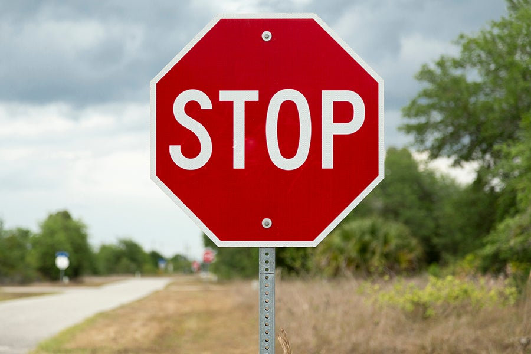
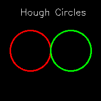

[Home](index.md) | [Classical](classical.md) | [Deep Learning](deep-learning.md) | [Datasets & Eval](datasets.md) | [Success/Failure](successes-failures.md) | [Challenges](challenges.md) | [Future](future.md) | [Bibliography](bibliography.md)

# Classical Detection Methods

This page covers **simple, classical approaches** before deep learning.

## Color-based approaches
- Threshold on red/yellow to isolate likely sign regions.
- Morphology (open/close) to clean up masks.

## Shape-based approaches
- Hough transform for circles.
-  
- Contour analysis & polygon approximation for triangles/octagons.

## Handcrafted features (HOG + SVM)
- Compute HOG per candidate ROI, classify with SVM.

**TODOs**
- Add 1–2 images showing color mask and a Hough circle result.
- Record a quick audio note here (30–60s) and link it.

<audio controls src="assets/audio/classical.mp3">Your browser does not support audio.</audio>
