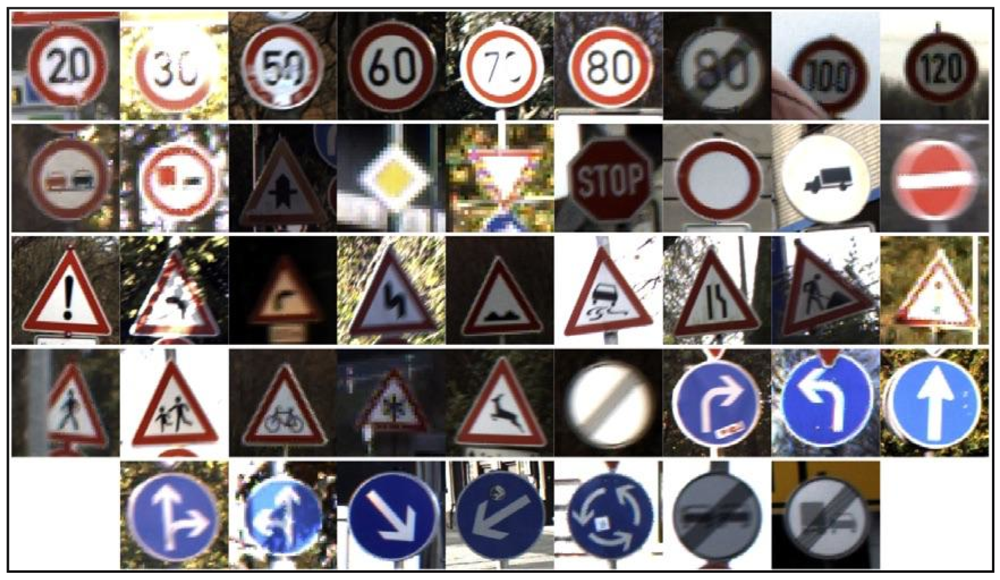
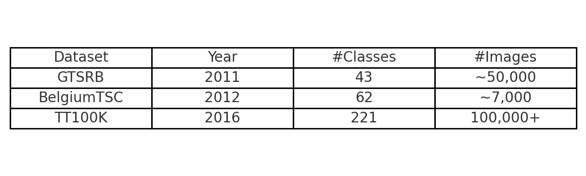

[Home](index.md) | [Classical](classical.md) | [Deep Learning](deep-learning.md) | [Datasets & Eval](datasets.md) | [Success/Failure](successes-failures.md) | [Challenges](challenges.md) | [Future](future.md) | [Bibliography](bibliography.md)

# Datasets & Evaluation Metrics

## Common datasets
- **GTSRB** — German Traffic Sign Recognition Benchmark (classification).
- **BelgiumTSC** — Belgium Traffic Sign Classification.
- **TT100K** — Large-scale traffic sign detection in the wild.
- (Optionally mention Mapillary Traffic Sign Dataset.)

## Metrics
- **Accuracy** (classification), **Precision/Recall/F1**.
- **mAP** (mean Average Precision) for detection.

  

**TODOs**
- Add a small table image or screenshot of sample classes.
- Audio note explaining metrics briefly.

<audio controls src="assets/audio/datasets.mp3">Your browser does not support audio.</audio>
