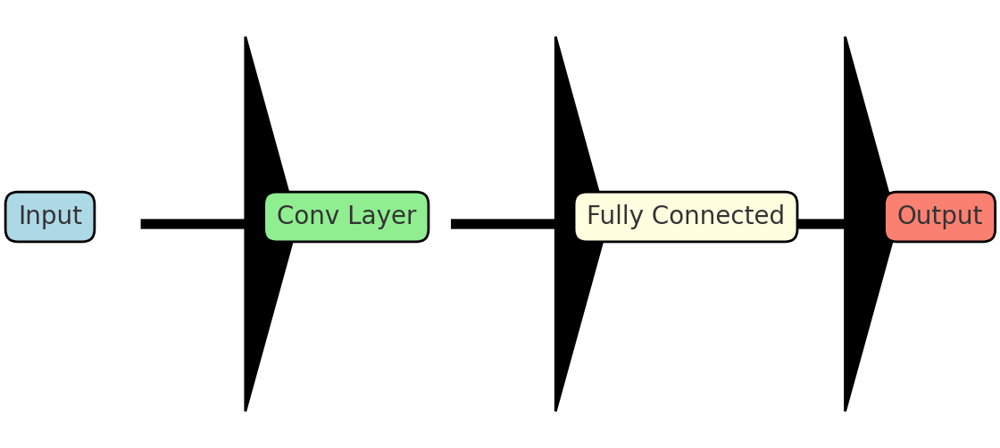
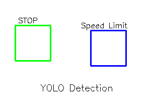

[Home](index.md) | [Classical](classical.md) | [Deep Learning](deep-learning.md) | [Datasets & Eval](datasets.md) | [Success/Failure](successes-failures.md) | [Challenges](challenges.md) | [Future](future.md) | [Bibliography](bibliography.md)

# Deep Learning Approaches

## CNN-based classifiers (overview)
- Convolutions learn features automatically.
- Typically classify cropped/sign ROIs.

  

## Lightweight CNNs for mobile
- Examples: MobileNet variants, YOLO-tiny family.

  

- Good for **real-time** on-device inference.

## Transformer-based methods
- Attention helps with **small/occluded** signs.
- Example: Pyramid Transformer (feature fusion with attention).

<audio controls src="assets/audio/deep.mp3">Your browser does not support audio.</audio>
