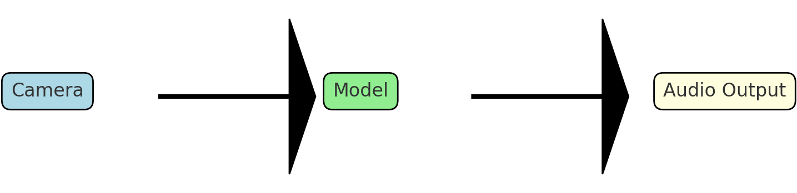

[Home](index.md) | [Classical](classical.md) | [Deep Learning](deep-learning.md) | [Datasets & Eval](datasets.md) | [Success/Failure](successes-failures.md) | [Challenges](challenges.md) | [Future](future.md) | [Bibliography](bibliography.md)

# Future Directions

- **Lightweight & quantized** models for edge devices.
- **Transformers** and better small-object handling.
- Integration into **assistive navigation** (camera → model → audio output).

  

<audio controls src="assets/audio/future.mp3">Your browser does not support audio.</audio>
