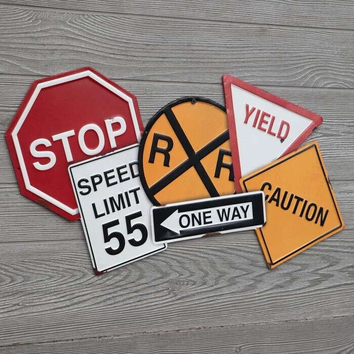

[Home](index.md) | [Classical](classical.md) | [Deep Learning](deep-learning.md) | [Datasets & Eval](datasets.md) | [Success/Failure](successes-failures.md) | [Challenges](challenges.md) | [Future](future.md) | [Refs](bibliography.md)

# Traffic Sign Detection & Classification

## Why this matters
- Critical for road safety  
  - Self-driving cars must detect and respond to signs  
- Accessibility for low-vision users  
  - Mobile apps can provide audio or haptic feedback  

## What this tutorial covers
- Classical methods (color, shape, HOG+SVM)  
- Deep learning (CNNs, YOLO-tiny, Transformers)  
- Benchmark datasets and metrics  
- Successes and failures  
- Key challenges  
- Future directions in research and accessibility  

  
*Figure: Common road signs like STOP, Yield, and Speed Limit.*

<audio controls src="assets/audio/intro.mp3">Your browser does not support audio.</audio>
