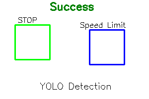

[Home](index.md) | [Classical](classical.md) | [Deep Learning](deep-learning.md) | [Datasets & Eval](datasets.md) | [Success/Failure](successes-failures.md) | [Challenges](challenges.md) | [Future](future.md) | [Bibliography](bibliography.md)

# Successes and Failures

## Where it works well
- Clear daylight, frontal view, clean signage.
- Benchmarks show high accuracy on curated datasets.

  

## Common failure cases
- **Small or distant** signs (few pixels tall).
- **Occlusion** (trees, vehicles), **weather/night**, **faded paint**.
- **Domain shift** (different countries/sign styles).

  

**TODOs**
- Add 1–2 side-by-side images: detected vs. missed.
- Short audio reflection on failure cases.

<strong>Interactive Quiz:</strong> Why might this traffic sign have been missed by the detector?

<form>
  <label><input type="radio" name="q4"> Occlusion or poor visibility</label> 
  <label><input type="radio" name="q4"> Model not trained on this class</label> 
  <label><input type="radio" name="q4"> Both could be possible</label>
</form>

<em>Hint:</em> Think about challenges like weather, occlusion, or dataset coverage.

<audio controls src="assets/audio/success-failure.mp3">Your browser does not support audio.</audio>
